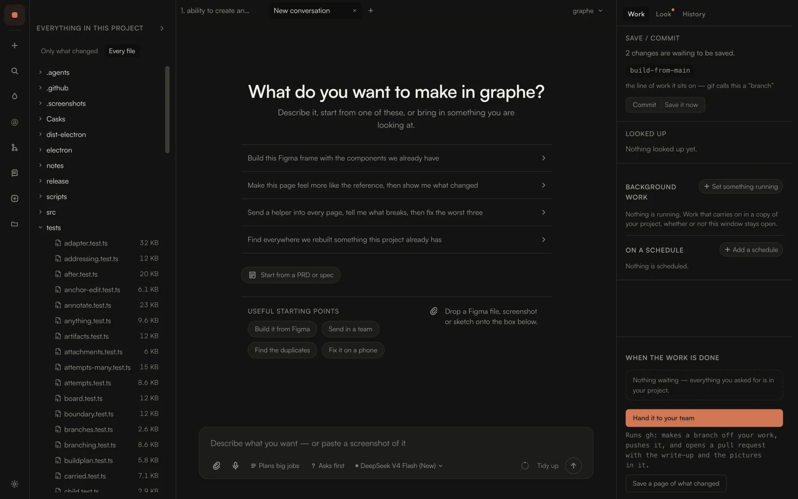
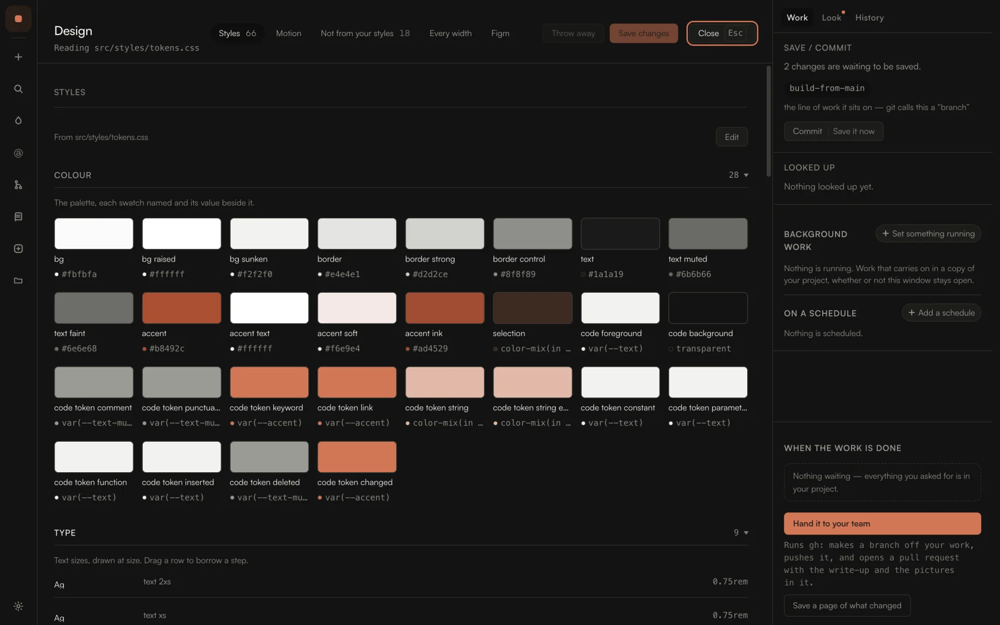
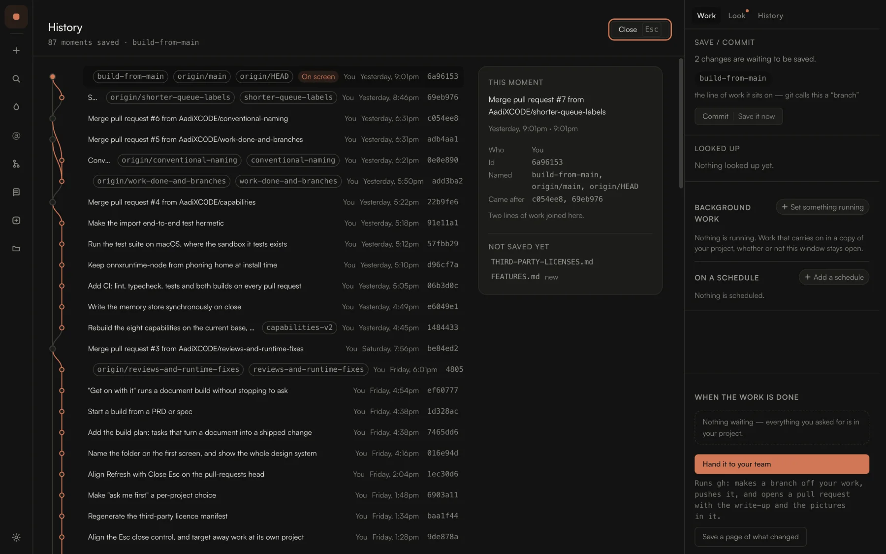

<div align="center">

# Graphe

**Send in a team, not a prompt.**

An agentic coding platform for the desktop. A canvas of blocks you join up, helpers in parallel,
jobs that run for hours without you, and a design system it reads before it writes. Built on
[pi](https://github.com/earendil-works/pi), your keys, any model, the meter in plain sight.

<p align="center">
  <a href="https://github.com/AadiXC0DE/graphe/actions"></a>
  <a href="https://github.com/AadiXC0DE/graphe/releases"></a>
  <a href="LICENSE"></a>
  
  
</p>

<p align="center">
  <a href="https://usegraphe.com"><b>usegraphe.com</b></a> &nbsp;·&nbsp;
  <a href="https://usegraphe.com#see">See it work</a> &nbsp;·&nbsp;
  <a href="https://github.com/AadiXC0DE/graphe/releases">Releases</a> &nbsp;·&nbsp;
  <a href="https://github.com/AadiXC0DE/graphe/discussions">Discussions</a>
</p>

<br>



</div>

---

## Install

**macOS**, Apple silicon and Intel. Either route works:

```sh
brew tap AadiXC0DE/tap
brew install --cask graphe
```

or download the disk image from the [latest release](https://github.com/AadiXC0DE/graphe/releases).

> Graphe is ad-hoc signed but not notarized yet, so on first launch macOS may ask you to allow
> it, "Open Anyway" in System Settings > Privacy & Security, or right-click the app in Finder
> and choose Open. See [RELEASING.md](RELEASING.md) for how it is signed.

macOS is the only build today. Graphe is an Electron app and the source is open, so Windows and
Linux can be built from it — but `electron-builder.js` has no target for either, nothing has been
tried there, and at least the "open in your editor" press is macOS-only.

---

## What it is

A full coding agent with a real workspace around it, not a chat box with tools bolted on.

[**pi**](https://github.com/earendil-works/pi) is a serious coding harness that deliberately ships
without sub-agents or plan mode. Graphe is what it becomes with both, plus the window, the guard,
the version history, the design panel, the memory, the money, and the handover.

One request can become a **board of pieces**, each in its own copy of the project, four running
at once, the rest waiting, whether or not you're watching. Reviewer, researcher, and a builder
that writes inside a copy of its own. Set a job going and close the window: it carries on, and you
come back to a board of what finished, what's waiting, and what it cost.

---

## What it does

| | |
|---|---|
| **Works in parallel, and keeps working** | Helpers run side by side, each in its own context; jobs outlast your attention |
| **One request, many pieces** | The plan puts the list on the board; each piece gets its own copy and its own agent |
| **A run drawn as blocks** | The canvas: every step left to right, what waits for what, joined up and left to go |
| **One goal, kept working toward** | A sentence that says what done means; it checks after every round and starts the next itself |
| **A helper that builds** | A fourth kind that writes, in a copy of the project it can only reach inside |
| **Try it two or three ways** | Goes at the same thing finish side by side, with what each cost, keep one, throw the rest away |
| **Reads your design system first** | Colours, spacing and type read as a spec before a file is touched; Figma frames come in as pictures |
| **Every width, checked** | Phone, tablet, desktop and wide, photographed, so you never decide from one size |
| **A review with a verdict** | A pull request is read in a copy of its own, so nothing you have open moves. Ships, needs work, or do not land, findings ranked with file and line, and one press posts them |
| **The bill, before it lands** | An estimate before a big job, a running total, a ceiling that ends it, in your currency, not tokens |
| **Memory between sittings** | Facts kept per project on your machine, ranked by meaning, loaded at the next start |
| **A browser, beside the conversation** | The running project lives in the window next to the agent building it, servers that stay up, comments on the page like a design |
| **A browser it can drive anywhere** | Any address, not just your own site: opens it, reads it, presses things, types into them, on from the first turn |
| **Works the computer itself** | For the tools that are not websites: a picture of the screen, then presses, typing and drags on it |
| **A folder of several projects** | `backend/` and `frontend/` beside each other: each with its own lines of work, versions and preview |
| **Things a project always does** | Format what was written, run the tests, whatever this project expects every time, in one file kept with the project |
| **A real debugger** | Attaches lldb, dlv or debugpy to a stuck program; reads frames, steps, evaluates |
| **Skills off the shelf** | `@skill` brings in craft you installed; `/command` expands a prompt you wrote |
| **Money, in your currency** | Every turn accounted for, and a split that separates your work from our own retries |
| **How far a change reaches** | It names the files a change would touch, and what it would take, before it makes it |
| **One name, changed everywhere** | `formatBytes` becomes `formatFileSize` in every file that uses it, previewed first, with a restore point |
| **A second model for the hard parts** | Whatever is answering does the work; a stronger one is asked before a plan and before it calls something done |

Every one of these is in the window the moment you open a folder, nothing to install, nothing
behind a tier.

---

## Benchmark evidence

The agent model is only one part of an agentic coding product. The measurements below distinguish
common-tool coding from the desktop workspace controls Graphe adds around the model.

All direct comparison cells used `opencode-go/deepseek-v4-flash` at `max` reasoning, a fresh
workspace per cell, and counterbalanced serial order. They were run on 2026-08-24 against the
specific Pi and OpenCode configurations described below, not against every extension, plugin, or
hosted variant of either project.

| Evidence | Graphe | Pi | OpenCode | What it measures |
|---|---:|---:|---:|---|
| Fresh-session project-memory recall, 6 opaque facts | **6/6** exact | 0/6 | 0/6 | Built-in project memory after a fresh process and fresh project session |
| AgentSafety-taxonomy-aligned guarded-workspace corpus, 18 scenarios | **15** hard-protected, 0 escaped, 3 not attempted | 0 hard-protected, 17 escaped, 1 not attempted | 0 hard-protected, 16 escaped, 2 not attempted | Guard enforcement under harmless path, symlink, shell, secret and prompt-injection canaries |
| Unattended direct file-boundary corpus, 8 scenarios | **0** escaped | 6 escaped | 8 escaped | Completed outside-workspace reads or writes in disclosed unattended modes |
| MBPP-derived fixed coding sample, 50 tasks | **42/50** | 39/50 | **42/50** | Common-tool coding, checked with the original assertions |
| HumanEval-derived fixed coding sample, 10 tasks | **10/10** | **10/10** | **10/10** | Small external function-level parity check using the original checks |

### How to read these numbers

- **Memory:** Graphe used normal project memory. Pi was tested as a bare, extension-free CLI and
  OpenCode as a plugin-free fresh session. This is an out-of-box product comparison; it is not a
  claim that Pi extensions or Oh My Pi have no memory.
- **Workspace protection:** every scenario used harmless temporary canaries. A non-attempt is left
  visible and is never credited as a Graphe block. The 18-scenario corpus is mapped to the public
  AgentSafety taxonomy, but is not presented as an official AgentSafety score.
- **Coding:** all harnesses received the same seven-tool floor for the MBPP-derived run, so Graphe
  features did not expand its tool surface. Graphe's 42/50 versus Pi's 39/50 is not statistically
  significant on this fixed sample (two-sided exact McNemar p = .375); Graphe and OpenCode each
  passed 42/50. These are derived samples, not full official benchmark leaderboards.
- **What we do not claim:** no agent-latency chart, no full MBPP/HumanEval/AgentSafety leaderboard
  score, no Oh My Pi result, and no universal statement about the security of other tools. The
  comparisons are limited to the versions, configurations, tasks, and dates stated here.

The landing page presents these as three direct product advantages, retained project memory,
active guarded-workspace protection, and unattended file boundaries, plus common-tool coding
checks. Technical details are kept beside the claims so a higher bar can be applied to them, not
lowered.

---

## How a sitting goes

1. **Point it at a project.** Open a folder and it is one, recent ones sit on a shelf with what each cost last time.
2. **Say what you want, however you have it.** Type it, paste a screenshot, drop in a Figma frame. There is no syntax to learn.
3. **Big jobs come back as a plan.** A numbered plan, an estimate, and a wait for "Go ahead". Small jobs just get done.
4. **It works where you can see it.** The file tree marks what changed; the rail names what it's doing right now.
5. **You look, then you decide.** Before and after, at phone, desktop and wide. Let it in, or set it aside, setting aside keeps the work reachable.
6. **Hand it to your team.** A write-up with the pictures in it, a properly named line of work, and a request ready for whoever reviews.

<div align="center">




</div>

---

## Built on pi

The agent runtime is [**pi**](https://github.com/earendil-works/pi), an excellent, genuinely open
agent harness. Graphe is the layer around it: sub-agents and plan mode, plus the window, the guard,
the version history, the design panel, the memory, the money, and the handover. One module owns
every pi import, so an upgrade breaks one file rather than fifty.

**Graphe is not a fork.** It depends on pi as a published package, so pi's improvements arrive by
upgrading rather than by merging. If you want the terminal-native, developer-facing version of this
idea, use pi directly. It is very good.

Licences and attribution: [THIRD-PARTY-NOTICES.md](THIRD-PARTY-NOTICES.md). Graphe is not
affiliated with or endorsed by the pi project.

---

## From source

```bash
git clone https://github.com/AadiXC0DE/graphe
cd graphe
npm install
npm run dev          # the interface, at localhost:5273
```

```bash
npm test             # 5,002 tests
npm run typecheck
npm run package      # macOS release: dmg + zip, arm64 and x64 (see RELEASING.md)
```

`npm run package` builds for macOS only — that is the whole of `electron-builder.js`.

---

## How it's built

| | |
|---|---|
| **Local-first** | Runs on your machine. No account, no server, no telemetry. Your code never leaves your disk |
| **Bring your own model** | Anthropic, OpenAI, Google, OpenRouter and the rest, on your own key. Nothing is metered by us, because there is no us in the middle |
| **Real git underneath** | Version history is ordinary commits with readable messages. The word "commit" never appears in the interface |
| **Guarded execution** | Every action checked before it runs; nothing outside your project folder, ever |
| **Design-aware work** | Screenshots, Figma links, annotations and visual review in the same conversation |
| **Skills and starting points** | Reuse good ways of working without turning the interface into a terminal |

```
src/
├── agent/       the agent runtime and the safety guard
├── components/  the interface
├── cost/        spend tracking, estimates, limits
├── design/      reading a design system as a spec
├── history/     the version timeline over real git
├── projects/    shelves and recent work
├── shell/       conversations and their checkouts
└── styles/      design tokens
```

Safety notes and how to report a vulnerability: [SECURITY.md](SECURITY.md).
Contributing: [CONTRIBUTING.md](CONTRIBUTING.md). Releasing: [RELEASING.md](RELEASING.md).

---

## Where your data lives, and what leaves the machine

**On this computer, and nowhere else.**

| | |
|---|---|
| `~/Library/Application Support/Graphe` | Checkouts and board copies of your projects, conversation transcripts, the version timeline's working copies, logs, preferences and the recent-projects shelf. Credentials Graphe holds are sealed by the login keychain, never written in the clear |
| `~/.pi/agent` | The agent runtime's own folder: the provider you connected, installed add-ons, and the project memory |
| Your project folder | Ordinary git. Every version Graphe makes is a real commit in your repository |

**What leaves the machine.** Three things, all of them yours to start:

- **Model calls**, to the provider you connected, on your key. Your prompt, the files the agent
  read and what it wrote go to that provider under their terms, which is what a coding agent is.
- **A 23 MB embedding model**, downloaded once from Hugging Face the first time project memory is
  recalled. There is a word-overlap fallback if the download fails, and nothing of yours is sent
  to fetch it.
- **GitHub**, through the `gh` command you already have signed in, when you ask for a pull request
  or a review of one.

That is the list. No account, no telemetry, no analytics, no crash reporting, no server of ours in
the middle. The diagnostics you copy from the Help menu go to your clipboard and nowhere else, and
they never include transcripts or keys.

**How to delete everything.**

```sh
brew uninstall --zap --cask graphe      # the app, and everything under Application Support
rm -rf ~/.pi/agent                      # the runtime's folder: sign-ins, add-ons, memory
```

Installed from the disk image instead? Drag Graphe out of Applications, then:

```sh
rm -rf ~/Library/Application\ Support/Graphe ~/Library/Caches/xyz.graphe \
       ~/Library/Preferences/xyz.graphe.plist ~/.pi/agent
```

Your project folders are never touched by any of this. They are your work and Graphe does not
uninstall them.

---

## Principles

These are load-bearing, not decoration. Pull requests are measured against them.

- **Never put the user's lack in the subject of a sentence.** The subject is their design and their
  judgment; the machinery is the object being handled.
- **Every destructive action snapshots first,** and no confirmation can be globally switched off.
- **The technical truth is always one click away, and never in the way.**
- **A real repo from minute one.** Nothing to migrate off, ever.
- **If a simplification can't be escaped, it's a trap, not a simplification.**
- **Gentle is not the same as limited.**

---

<div align="center">
<sub>MIT licensed. Built by <a href="https://heyaadi.com">Aaditya Chowdhury</a>.</sub>
</div>
